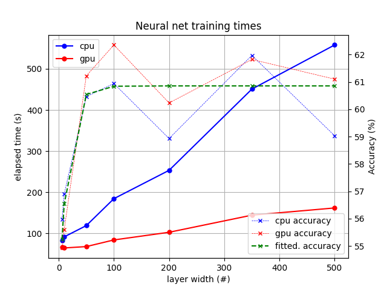

# Pytorch
Investigate runtimes using a cpu and a gpu as training devices

The code is adapted from [the pytorch tutorial](https://pytorch.org/tutorials/beginner/blitz/cifar10_tutorial.html) and answers the following question:

Exercise: Try increasing the width of your network (argument 2 of the first nn.Conv2d, and argument 1 of the second nn.Conv2d – they need to be the same number), see what kind of speedup you get.

.
